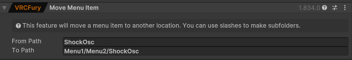

[](https://discord.gg/OpenShock) [](https://unity.com/) [](https://store.steampowered.com/app/661130/ChilloutVR/) [](https://store.steampowered.com/app/438100/VRChat/) [](https://vrcfury.com/)


# Openshock Prefabs
Here you'll find some prefabs I created in Unity for [VRChat (VRC)](https://store.steampowered.com/app/438100/VRChat/) and [ChilloutVR (CVR)](https://store.steampowered.com/app/661130/ChilloutVR/) to utilize the [Openshock](https://github.com/OpenShock) project in either of those games.

All of the [VRChat](https://store.steampowered.com/app/438100/VRChat/) prefabs use [VRCFury](https://vrcfury.com/).

To use [ShockOSC](https://github.com/OpenShock/ShockOsc) in ChilloutVR you'll need a OSC mod. One of the most popular ones are [OSC by kafeijao](https://github.com/kafeijao/Kafe_CVR_Mods?tab=readme-ov-file).

When multiple VRChat Prefabs are used together by default they should combine into one single Sub-Menu.
  
  
  
## List of Prefabs
| Name              |Parameters|CVR|VRC| Description   |
| :-------------:     | :-------------: |:----------:|:-----------:|:---------------|
| [Shocker](https://github.com/Kyobinoyo/OpenshockPrefabs/releases/tag/Shocker)                         |3|✔️|✔️| A Shocker model inclusive trigger prefab to make it possible to shock you in VR by touching the Shocker using [ShockOSC](https://github.com/OpenShock/ShockOsc)|
| [Remote Trigger](https://github.com/Kyobinoyo/OpenshockPrefabs/releases/tag/RemoteTrigger)            |1|❌|✔️| A combination of prefabs to make it possible to shock you over distance like using a remote utilizing contacts and [ShockOSC](https://github.com/OpenShock/ShockOsc)|
|[Settings Menu](https://github.com/Kyobinoyo/OpenshockPrefabs/releases/tag/SettingsMenu)               |0 |❌|✔️|A Menu for editing [ShockOSC](https://github.com/OpenShock/ShockOsc) settings from within the game. __**Needs ShockOsc v2.0 or newer**__|  

❌ = not yet available  
✔️ = available 

## Tips
### Move the ShockOSC Sub-Menu into another Sub-Menu:
By default the ShockOsc Sub-Menu gets created in the main menu page.  
If you want to move it, just click on your avatars root object, then add the "VRCFury | Move Menu Item" component and configure it like this with your own path:  
  
Make sure you name the menu you want it to be in correctly.
After that the menu should be where you want it to be.  

## FAQ
### Q: VRCFury is throwing some error.
A: Make sure you have enough parameter memory slots free for the prefab you want to use.  
if this doesn't help contact me on the [Openshock Discord](https://discord.gg/OpenShock).  

### Q: Why is ShockOsc not reacting to my Shocker being touched?
A: First make sure [OSC](https://docs.vrchat.com/docs/osc-overview#how-do-i-use-it) is active, if that's not the problem, check if you named the parameters correctly, ``ShockOsc/NAME`` while NAME should be replaced by the group name in ShockOsc do not remove the ``ShockOsc/``. If this is still not working, VRChat is being funny, when updating an Avatar, most of the time it does not update the parameters for OSC, to fix that go to  
```
C:\Users\%USERPROFILE%\AppData\LocalLow\VRChat\VRChat\OSC
```  
and delete the files there, it'll not damage your game you can even do it while being in-game, after you change back in to your avatar it should generate new files with your parameters updated.  

### Q: Why is my friend getting shocked every time my Avatar is loaded in?
A: Make sure the **Sender** object is disabled while uploading the Avatar, otherwise the Sender object is active when you load in and get's disabled when the parameter sync kicks in, resulting in a shock.  

### Q: Why can't I shock myself? I have the Sender and Receiver on my avatar!
A: In the *Receiver* script enable **Allow Self**

### Q: Why do I have to merge Animators and stuff myself when I want to use it in CVR?
A: Sadly there is not solution like VRCFury I'm aware of that is made for CVR. That means no fancy tool to do the annoying work.
